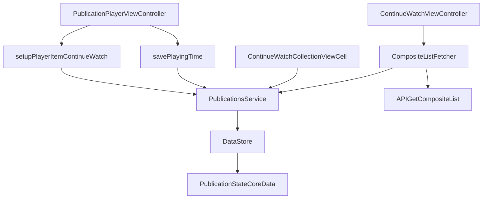

# iOS Continue Watching: implementation map

This note documents how `Continue Watching` is implemented in `ios/euforia`.

## 1) UI entry points

- Main screen block: `ios/euforia/Euforia/ViewControllers/ContinueWatchViewController.swift`
  - Builds sections:
    - `.meditationContinueWatch`
    - `.exerciseContinueWatch`
  - Screen title: `continue_watch_title`
  - Uses composite template key: `"continue_watch"`
- Section implementations:
  - `ios/euforia/Euforia/ViewControllers/CompositeList/Sections/ContinueWatchCollectionSection.swift`
  - `ios/euforia/Euforia/ViewControllers/CompositeList/Sections/ContinueWatchPublicationsCollectionSection.swift`
- Cell:
  - `ios/euforia/Euforia/Views/Cells/ContinueWatchCollectionViewCell.swift`
  - For publications, reads state from `PublicationsService.shared.getPublicationState(for:)`
  - Displays `playingProgress` via `UIProgressView`

## 2) End-to-end data flow (Continue Watching)

### Composite-list flow

1. `ContinueWatchViewController` requests composite sections.
2. `CompositeListFetcher.requestParametersItem(from:)` handles:
   - `.meditationContinueWatch`
   - `.exerciseContinueWatch`
3. For each section, fetcher calls:
   - `PublicationsService.shared.getContinueWatchingPublicationsStates(for:limit:)`
4. Service proxies to CoreData layer:
   - `DataStore.getStatesForContinueWatchingPublications(for:minTimeInterval:limit:)`
5. CoreData predicate for continue state:
   - `isPlayingCompleted == FALSE && playingTime > 0`
   - sorted by `lastViewingTimestamp DESC`
6. Fetcher extracts `entityId` list and sends API query with:
   - `filters["ids"] = [...]`
   - `filters["sort-attribute"] = "ids"`
7. Content payload is fetched via composite endpoint:
   - `API.getCompositeList(...)`

### Dedicated list flow (full screen)

- `ContinueWatchPublicationsListViewController.getIDs()`:
  - gets IDs from `getContinueWatchingPublicationsStates(...)`
- `HistoryPublicationsListViewController.getIDs()`:
  - gets IDs from `getLastViewingPublicationsStates(...)`
- `PublicationsIDsListViewController.setupPaginatedDataSource()`:
  - calls `API.getPublications(type:options:pagination:)`
  - forces order by IDs (`sortAttribute = "ids"`)

## 3) Playback progress write + resume

### Where progress is written

- `PublicationPlayerViewController` writes playback state in:
  - `viewWillDisappear` -> `savePlayingTime()`
  - app terminate notification -> `savePlayingTime()`
  - playback completion -> `savePlayingTime(isFinished: true)`
- `savePlayingTime(...)` computes:
  - `time` (or full duration if completed)
  - `duration`
  - `isCompleted`
- Then calls:
  - `PublicationsService.updatePlayingTime(for:time:duration:isCompleted:)`
- Service persists to CoreData:
  - `playingTime`
  - `playingDuration`
  - `isPlayingCompleted = oldValue || isCompleted`

### Where "last viewed" is written

- `PublicationViewController.updateViews()` calls once per screen appearance logic:
  - `PublicationsService.shared.updateLastViewingTimestamp(for: publication)`
- Service stores:
  - `lastViewingTimestamp = Date()`
  - `viewCount += 1`

### How resume works

- `ContinueWatch` open path passes `continueWatch: true` to publication screen/player.
- In `PublicationPlayerViewController.setupPlayerItem(continueWatch:)`:
  - reads state from `PublicationsService.getPublicationState(for:)`
  - seeks to `state.playingTime` using `player.seek(...)`

## 4) Continue Watching vs History

- Continue Watching:
  - only incomplete playback with non-zero progress
  - predicate: `isPlayingCompleted == FALSE && playingTime > 0`
- History:
  - anything viewed with timestamp
  - predicate: `lastViewingTimestamp != NULL`

## 5) Related soundscapes branch

Soundscapes use a parallel store, not `PublicationsService`:

- Last viewed:
  - `AudioScenesStore.updateLastViewingTimestamp(for:)`
  - `DataStore.getStatesForLastViewingAudioScenes(...)`
- Listening duration:
  - `AudioScenePlayer.savePlayingDuration()`
  - `AudioScenesStore.appendPlayingDuration(_:for:)`
- Playlist type mapping:
  - `AudioScenePlaylistType.continueWatch`
  - resolves to `AudioScenesStore.getLastViewingAudioScenes(limit:)`

## 6) Localization keys relevant to requested screen

File: `ios/euforia/Euforia/Resources/en.lproj/Localizable.strings`

- `continue_watch_title` = `Continue Watching`
- `profile_title` = `My Euforia`
- `playlists_title` = `Playlists`
- `favorites_title` = `Favorites`

Note: exact string `Recently viewed` is not present; iOS naming is primarily `Continue Watching` and `History`.

## 7) Mermaid overview

## 8) My Euforia: `smartContinueWatch` (composite profile)

This is the block used on the profile / “My Euforia” style layouts from Remote Config (`type: smart_continue_watch`), **not** the same as the dedicated `ContinueWatchViewController` screen.

- **Fetcher:** `CompositeListFetcher.requestParametersItem` — case `.smartContinueWatch` calls `makeSmartContinueWatchPublicationsRequestParametersItem`, which uses `DataStore.shared.getStatesForSmartContinueWatching()` (see `ios/euforia/Euforia/Others/CompositeList/CompositeListFetcher.swift`, extension at end of file).
- **DataStore:** `getStatesForSmartContinueWatching(daysInterval:)` (`ios/euforia/Euforia/Others/DataStore/DataStore.swift`, ~293–314):
  - Default `daysInterval` from Remote Config key **`continue_watch_time_interval`** (days); if `> 0`, builds `minTimeInterval` for `makePredicateForMinLastViewingTimestamp`.
  - Takes **at most one** candidate from each branch: meditation continue-watch state, exercise continue-watch state, **last-viewed audio scene** (`getStatesForLastViewingAudioScenes`, limit 1).
  - Merges non-nil results and **sorts by `lastViewingTimestamp` descending** before returning `[EntityState]` for the composite list request.
- **Cell UI:** `ContinueWatchCollectionViewCell` — publications use linear `playingProgress`; `AudioScene` uses **`infinityProgressView`** (no linear progress).

## 9) Swift files touching Continue Watching (search index)

Paths under `ios/euforia/Euforia/` that match `ContinueWatch`, `continue_watch`, or `continueWatch` (useful for onboarding / code search):

- `AudioScenes/AudioScenesStore.swift`
- `AudioScenes/AudioScenesWidgetsState.swift`
- `Models/AudioScene/AudioScenePlaylistType.swift`
- `Others/CompositeList/CompositeListFetcher.swift`
- `Others/CompositeList/CompositeListItemsRegistryExtension.swift`
- `Others/CompositeList/CompositeListItemTypeExtension.swift`
- `Others/CompositeList/Descriptions/ContinueWatchPublicationsItemDescription.swift`
- `Others/CompositeList/Descriptions/SmartContinueWatchPublicationsItemDescription.swift`
- `Others/CompositeList/Descriptions/Standard/CustomListsItemDescription.swift`
- `Others/DataStore/DataStore.swift`
- `Others/DeepLinks/DeepLinksHandler.swift`
- `Others/Services/PublicationsService.swift`
- `ViewControllers/ContinueWatchViewController.swift`
- `ViewControllers/CompositeList/CompositeListViewControllerSectionsProvider.swift`
- `ViewControllers/CompositeList/Sections/ContinueWatchCollectionSection.swift`
- `ViewControllers/CompositeList/Sections/ContinueWatchPublicationsCollectionSection.swift`
- `ViewControllers/CompositeList/Sections/EntitiesCollectionSection.swift`
- `ViewControllers/CompositeList/Sections/PublicationsCollectionSection.swift`
- `ViewControllers/PremiumUpgrade/Variants/v12/PremiumUpgradeView_v12.swift`
- `ViewControllers/Publication/ContinueWatchPublicationsListViewController.swift`
- `ViewControllers/Publication/PublicationPlayerViewController.swift`
- `ViewControllers/Publication/PublicationsListViewControllerBuilder.swift`
- `ViewControllers/Publication/Details/PublicationContentViewController.swift`
- `ViewControllers/Publication/Details/PublicationViewController.swift`
- `ViewControllers/Publication/Details/PublicationViewControllerBuilder.swift`
- `Views/Cells/ContinueWatchCollectionViewCell.swift`

## 10) Android implementation guide

Step-by-step MVP and optional `smartContinueWatch` parity: [android-continue-watching-implementation.md](android-continue-watching-implementation.md).

